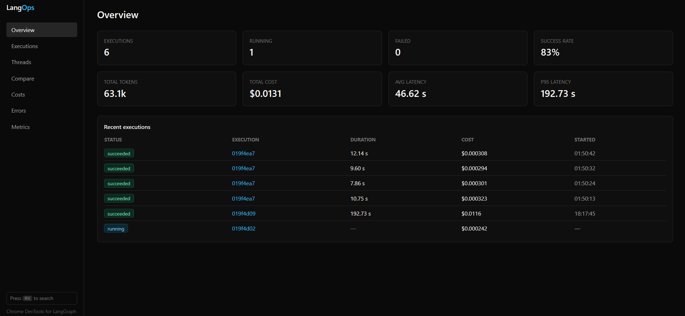
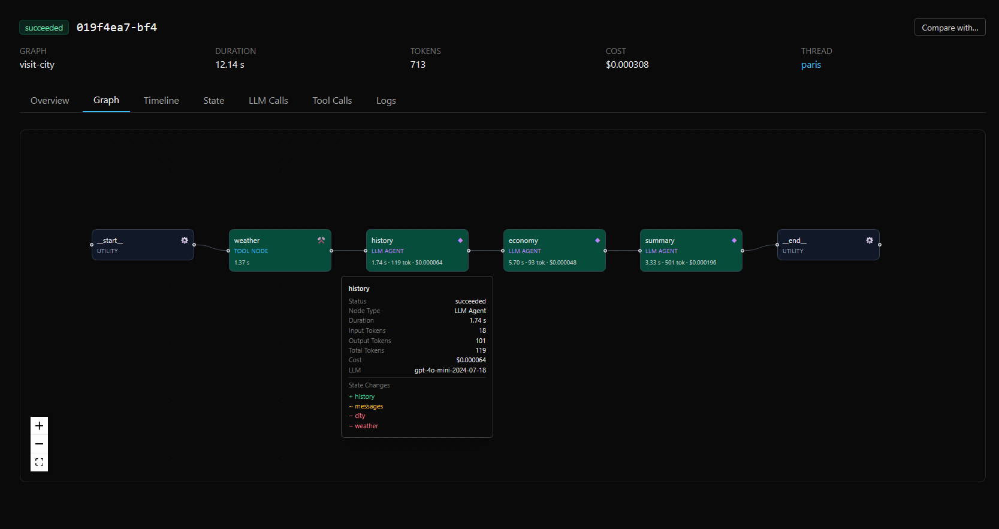
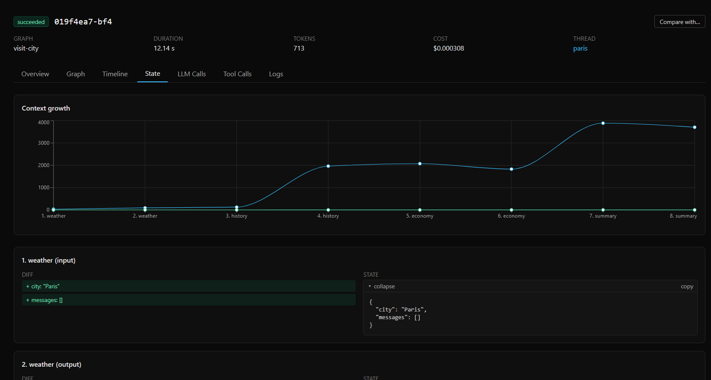

# LangOps

> **A lightweight observability and evaluation platform for LangGraph applications.**


LangOps is an open-source developer platform that provides deep observability, debugging, and evaluation capabilities for **LangGraph-based AI applications**.

Instead of replacing LangGraph, LangOps integrates seamlessly into existing projects to help developers understand exactly what happens inside their agent workflows. It automatically captures graph executions, node transitions, LLM calls, state changes, token usage, costs, latency, tool invocations, and execution logs—all accessible through a modern web dashboard.

The goal of LangOps is to become the **Chrome DevTools for LangGraph**, enabling developers to monitor, debug, replay, and optimize complex multi-agent systems from development to production.

---

> ⚠️ **LangOps is currently in active development (pre-v1.0).**
> APIs and features may change as the project evolves. Feedback, issues, and contributions are highly welcome.

---

# Dashboard Preview

### Execution Overview

<p align="center">
    
</p>

The execution overview provides a complete timeline of every LangGraph run, including node execution order, latency, LLM requests, token usage, tool invocations, execution status, and detailed trace metadata.

---

### Graph Visualization

<p align="center">
    
</p>

Visualize your LangGraph workflows as interactive execution graphs. Follow node transitions, inspect execution paths, and quickly understand how your agents move through complex workflows.

---

### Context Growth

<p align="center">
    
</p>

Monitor how conversation state evolves throughout execution. Inspect state updates, message accumulation, context expansion, and identify unnecessary context growth that impacts latency and token costs.

---

# Documentation

Full documentation lives inside [`docs/`](docs/README.md).

## Guides

- **[Setup & Usage](docs/setup.md)** — Install and instrument your application
- **[SDK](docs/sdk.md)**
- **[Backend](docs/backend.md)**
- **[Dashboard](docs/dashboard.md)**
- **[Collector](docs/collector.md)**
- **[Examples](docs/examples.md)**

## Reference

- **[Architecture](docs/architecture.md)**
- **[Semantic Conventions](docs/semantic-conventions.md)**
- **[Database](docs/database.md)**
- **[Architecture Decision Records](docs/adr/)**

---

# Getting Started

Clone the repository

```bash
git clone https://github.com/yourusername/langops.git

cd langops
```

Start the complete stack

```bash
docker compose up --build
```

---

# Services

| Service | URL |
|----------|-----|
| Dashboard | http://localhost:3000 |
| API | http://localhost:8000 |
| API Documentation | http://localhost:8000/docs |
| PostgreSQL | localhost:5432 |
| Redis | localhost:6379 |

---

# Instrument a LangGraph Application

Install the SDK

```bash
pip install -e ./sdk
```

Instrument your compiled graph

```python
from langops import instrument

graph = instrument(graph)

graph.invoke(
    ...,
    config={
        "configurable": {
            "thread_id": "abc"
        }
    }
)
```

LangOps exports telemetry using **OpenTelemetry** to the Collector.

Every execution automatically captures:

- Graph executions
- Node transitions
- LLM requests & responses
- Tool invocations
- State diffs
- Token usage
- Cost estimation
- Execution latency
- Runtime logs

Instrumentation is fully fault-isolated. If telemetry fails, your LangGraph application continues executing normally.

---

# Try it End-to-End

Run the full platform

```bash
docker compose up --build
```

Install the SDK

```bash
pip install -e ./sdk
```

Run the example application

```bash
python examples/simple-agent/main.py
```

Open the dashboard

```text
http://localhost:3000
```

The execution will automatically appear inside LangOps.

You can also execute the complete end-to-end smoke test.

```bash
make e2e
```

The test:

- Builds the complete Docker stack
- Executes the example application
- Verifies execution persistence
- Tests Collector retry behavior
- Validates API availability

---

# Design Principles

LangOps is built around four principles.

## Simple

Minimal configuration with sensible defaults.

## Lightweight

Low runtime overhead with seamless integration into existing LangGraph projects.

## Developer-first

Designed specifically to help developers inspect, debug, and optimize AI agent workflows.

## Framework-aware

Built specifically for LangGraph instead of generic LLM tracing abstractions.

---

# Vision

LangOps aims to become the observability platform for LangGraph.

The long-term vision extends beyond tracing into a complete developer platform for AI agents, including:

- Execution replay
- State inspection
- Graph debugging
- Performance profiling
- Cost analysis
- Prompt inspection
- Evaluation pipelines
- Production monitoring

Just as Chrome DevTools transformed web development, LangOps aims to become the essential debugging toolkit for LangGraph applications.

---

# Contributing

Contributions are always welcome.

Before contributing, please read:

- [Architecture Design](docs/architecture.md)
- [Contributing Guide](docs/contributing.md)

Setup

```bash
cp .env.example .env

make lint

make test

make e2e
```

Development guidelines

- Respect the backend architecture layers
- Register new OpenTelemetry attributes in `docs/semantic-conventions.md`
- Document major architectural decisions using ADRs
- Follow Conventional Commits

---

# License

Licensed under the Apache-2.0 License.

See [LICENSE](LICENSE).
